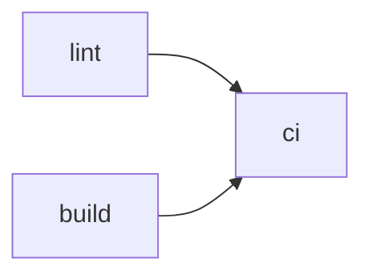

# home-manager

## what

My setup for [Home Manager](https://nix-community.github.io/home-manager/)

## why

It's very handy to be able to have consistency across different machines

## how

### development

Make changes as needed and test on the local machine e.g `home-manager switch --flake .#otto@aarch64-darwin`

### normal use

Anywhere this is used, entering `switch` into the terminal will link to the `main` branch of this repo and update the settings

## CI

The `ci` job is required to pass before merging to `main`, enforced by the org-level ruleset in [github-settings](https://github.com/ojhermann-org/github-settings). `lint` and `build` run in parallel; `ci` gates on both.

